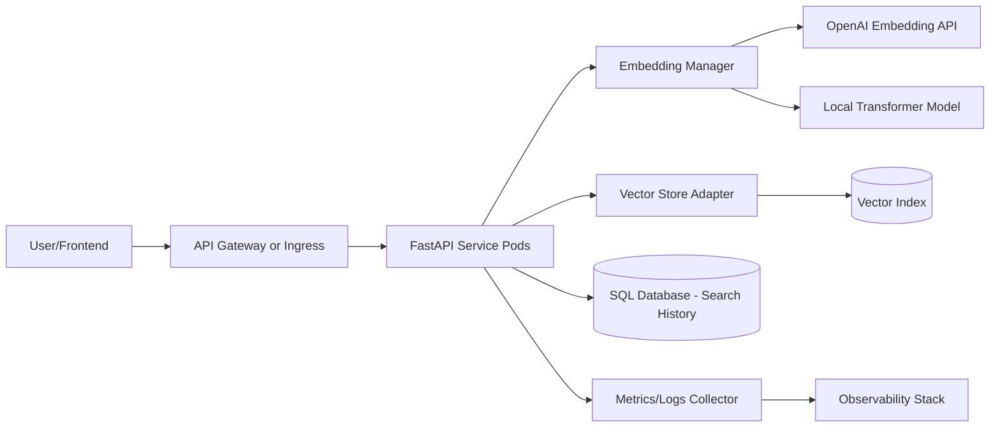

# Architecture Overview

## POC vs Production

- POC: single FastAPI container + in-memory vector store.
- Production: API gateway, load balancer, multi-replica K8s deployment, managed DB, external vector DB.

## MLOps/Observability

- Structured logs with query, model version, latency, scores.
- Health endpoints for liveness/readiness.
- Model version surfaced in responses and logs.
