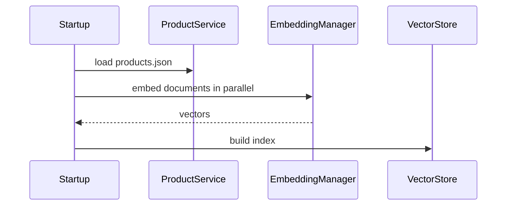
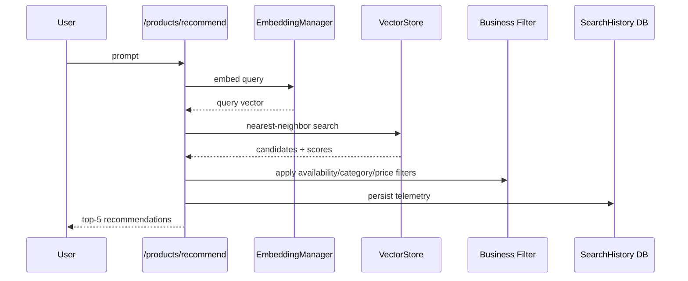

# Data Flow

## Ingestion Flow

```mermaid
sequenceDiagram
  participant S as Startup
  participant P as ProductService
  participant E as EmbeddingManager
  participant V as VectorStore
  S->>P: load products.json
  S->>E: embed documents in parallel
  E-->>S: vectors
  S->>V: build index
```

## Retrieval Flow

```mermaid
sequenceDiagram
  participant U as User
  participant API as /products/recommend
  participant E as EmbeddingManager
  participant V as VectorStore
  participant B as Business Filter
  participant DB as SearchHistory DB
  U->>API: prompt
  API->>E: embed query
  E-->>API: query vector
  API->>V: nearest-neighbor search
  V-->>API: candidates + scores
  API->>B: apply availability/category/price filters
  API->>DB: persist telemetry
  API-->>U: top-5 recommendations
```
